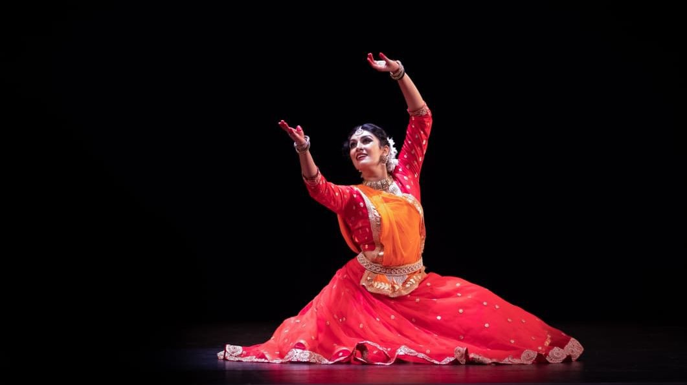

# Multi-Class_Image_classification_using_transfer_learning
<strong>Hackerearth Deep Learning Challenge to classify images of indian classical dance form into 8 different categories</strong>

Problem Statement :- To build an image tagging deep learning model that can helpy to classify these images into 8 categories of indian classical dance.

Dataset details :- The dataset consists of 364 images belonging to 8 categories, namely manipuri, bharatanatyam, odissi, kathakali, kathak, sattriya, kuchipudi, and mohiniyattam.

Used VGG19 Model to perform Transfer Learning

<i>Sample Image : Indian Classical Kathak Dance Form</i>

